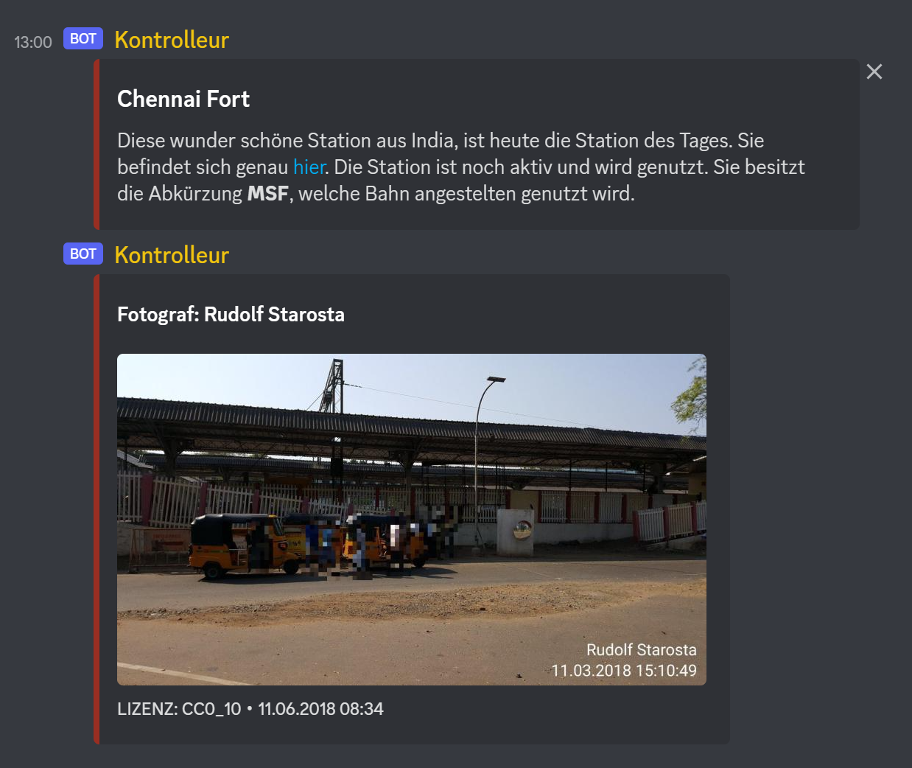
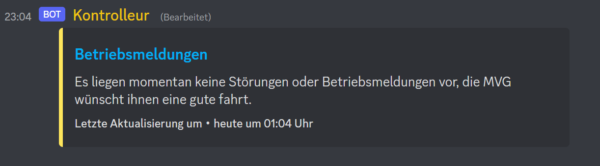

# DiscordBot

A discord bot for the DeutscheBahn2 discord server

## Features
* play Youtube videos/playlists
  * change the status to the current playing song
  * have a look at the queued songs
  * a database with requested song's and requester
* Post a Station of the Day message to subscribed channels in a specified interval
* Post the current delays of the mvg in the subscribed channels

## Discord Commands

### Music 
````
!play   <your link / youtube search>
!pause  pause the current song
!resume resume the current song
!stop   stop the bot and discord the current queue
!queue  show waht songs are in the queue
!skip   stop the current playingt song and play the next one in the queue
````

### Deutschebahn

````
!subscribe   Subscribe to the Station of the day message with this channel
!unsubscribe Unsubscribe to the Station of the day message with this channel
````

An example Station of the day message. You can control when the station message should be [posted](#hour)


### Mvg

````
!subscribe-slim   Subscribe to the mvg disruption ticker
!unsubscribe-slim Unsubscribe to the mvg disruption ticker
````

Example message:


# Installation

## development

```bash
git clone https://github.com/Plutokekz/DiscordBot
cd DiscordBot
poetry install
```

```bash
export DiscordToken="Your Discord Token"
poetry run python main.py
```

## docker and docker-compose

```bash
git clone https://github.com/Plutokekz/DiscordBot
cd DiscordBot
docker build -t discord-bot .
```

Add your Discord token to the ``docker-compose.yml`` file

```bash
docker-compose up -d
```

# Config

the config file is located in the ``config`` directory. Every Discord Cog has its own section.

## Music

config for the music_cog

### Online

#### ytdl_format_options

config for the youtube_dl module. For morw Information checkout 
[youtube_dl](https://github.com/ytdl-org/youtube-dl/blob/master/README.md#configuration)

#### ffmpeg_options

config for the ```discord.FFmpegPCMAudio```, nothing spacial.
For more information checkout the [discordpy api](https://discordpy.readthedocs.io/en/latest/api.html#ffmpegpcmaudio)

#### default_info

If youtube_dl cant fetch all metadata, the data from this config get taken

## deutschebahn

config for the deutschebahn_cog

### hour

an hour when the Station of the Day message gets posted every day